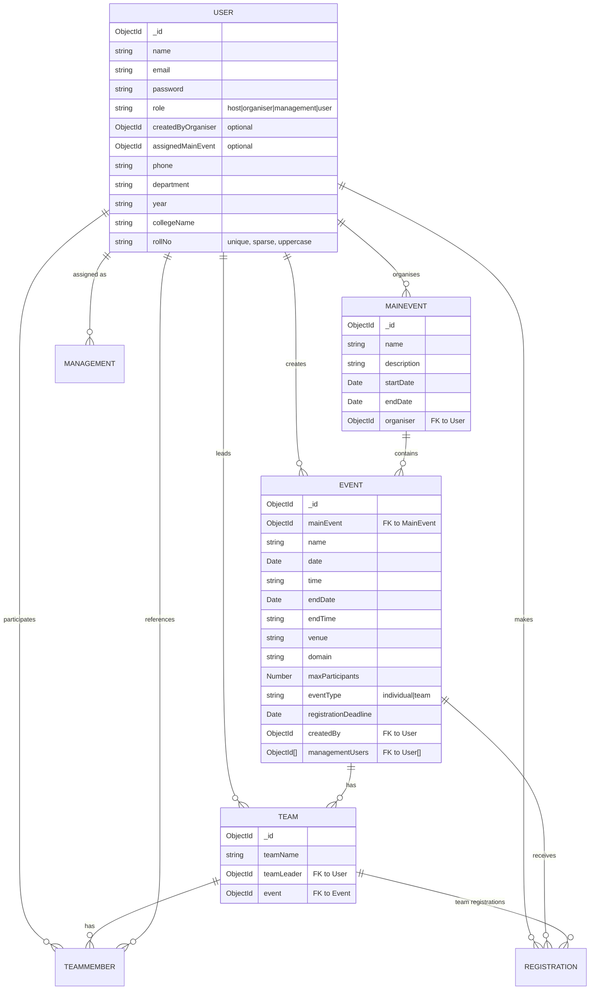
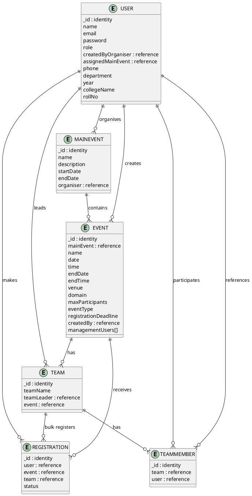

# Entity-Relationship (ER) Diagram
## University Event Registration Management System

This document provides the ER diagram showing all entities, attributes, and relationships in the system.

---

## 1. ER Diagram - Mermaid Format



---

## 2. Detailed Entity Descriptions

### 2.1 USER Entity

**Purpose:** Store all user accounts with role-based access

| Attribute | Type | Constraints | Description |
|-----------|------|-------------|-------------|
| `_id` | ObjectId | Primary Key | MongoDB unique identifier |
| `name` | String | Required | User's full name |
| `email` | String | Unique, Required | User's email address |
| `password` | String | Required | Bcrypt hashed password |
| `role` | String | Enum: `host`, `organiser`, `management`, `user` | Role determines access level |
| `createdByOrganiser` | ObjectId | Foreign Key (User) | Optional - organiser who created management user |
| `assignedMainEvent` | ObjectId | Foreign Key (MainEvent) | Optional - main event assigned to management user |
| `phone` | String | Optional | Contact number |
| `department` | String | Optional | Department/Faculty name |
| `year` | String | Optional | Academic year |
| `collegeName` | String | Optional | College/University name |
| `rollNo` | String | Unique, Sparse, Uppercase | Optional - Student roll number |

**Relationships:**
- Organises → MainEvent (1:N)
- Creates → Event (1:N)
- Assigned as Management → Event (N:M)
- Leads → Team (1:N)
- Makes → Registration (1:N)
- Participates → TeamMember (1:N)

---

### 2.2 MAINEVENT Entity

**Purpose:** Store umbrella events at the top level

| Attribute | Type | Constraints | Description |
|-----------|------|-------------|-------------|
| `_id` | ObjectId | Primary Key | MongoDB unique identifier |
| `name` | String | Required | Event name (e.g., "Annual Fest 2026") |
| `description` | String | Optional | Event description and details |
| `startDate` | Date | Required | Event start date |
| `endDate` | Date | Required | Event end date |
| `organiser` | ObjectId | Foreign Key (User), Required | Organiser who created this event |

**Relationships:**
- Contains → Event (1:N)
- Created by → User (N:1)

---

### 2.3 EVENT Entity

**Purpose:** Store sub-events under main events

| Attribute | Type | Constraints | Description |
|-----------|------|-------------|-------------|
| `_id` | ObjectId | Primary Key | MongoDB unique identifier |
| `mainEvent` | ObjectId | Foreign Key (MainEvent), Required | Parent main event |
| `name` | String | Required | Sub-event name (e.g., "Coding Challenge") |
| `date` | Date | Required | Event date |
| `time` | String | Optional | Event start time |
| `endDate` | Date | Optional | Event end date |
| `endTime` | String | Optional | Event end time |
| `venue` | String | Optional | Physical location |
| `domain` | String | Optional | Event category/domain |
| `maxParticipants` | Number | Required, Min: 1 | Maximum allowed registrations |
| `eventType` | String | Enum: `individual`, `team` | Registration type |
| `registrationDeadline` | Date | Optional | Last date to register |
| `createdBy` | ObjectId | Foreign Key (User), Required | Creator (organiser/management/host) |
| `managementUsers` | ObjectId[] | Foreign Key (User[]) | Management users assigned to this event |

**Relationships:**
- Child of → MainEvent (N:1)
- Has Teams → Team (1:N)
- Receives Registrations → Registration (1:N)
- Created by → User (N:1)
- Assigned to → User (N:M via managementUsers)

---

### 2.4 TEAM Entity

**Purpose:** Store teams created for team-based events

| Attribute | Type | Constraints | Description |
|-----------|------|-------------|-------------|
| `_id` | ObjectId | Primary Key | MongoDB unique identifier |
| `teamName` | String | Required | Team's display name |
| `teamLeader` | ObjectId | Foreign Key (User), Required | User who leads the team |
| `event` | ObjectId | Foreign Key (Event), Required | Event this team participates in |

**Unique Constraint:** `(event, teamName)` - No duplicate team names per event

**Relationships:**
- Led by → User (N:1)
- For Event → Event (N:1)
- Has Members → TeamMember (1:N)
- Has Registrations → Registration (0:N)

---

### 2.5 TEAMMEMBER Entity

**Purpose:** Link users to teams (junction table)

| Attribute | Type | Constraints | Description |
|-----------|------|-------------|-------------|
| `_id` | ObjectId | Primary Key | MongoDB unique identifier |
| `team` | ObjectId | Foreign Key (Team), Required | Team reference |
| `user` | ObjectId | Foreign Key (User), Required | User/member reference |

**Unique Constraint:** `(team, user)` - No duplicate memberships

**Relationships:**
- Belongs to → Team (N:1)
- References → User (N:1)

---

### 2.6 REGISTRATION Entity

**Purpose:** Store event registrations for users and teams

| Attribute | Type | Constraints | Description |
|-----------|------|-------------|-------------|
| `_id` | ObjectId | Primary Key | MongoDB unique identifier |
| `user` | ObjectId | Foreign Key (User), Required | Registering user |
| `event` | ObjectId | Foreign Key (Event), Required | Event being registered for |
| `team` | ObjectId | Foreign Key (Team), Optional | Team registration (for team events) |
| `status` | String | Enum: `confirmed`, `pending`, `cancelled` | Registration status |

**Unique Constraint:** `(user, event)` - User can register once per event

**Relationships:**
- Made by → User (N:1)
- For → Event (N:1)
- Optional Team → Team (N:1)

---

## 3. Relationship Definitions

### 3.1 Cardinality & Participation

| From | To | Relationship | Cardinality | Type |
|------|-----|-------------|-------------|------|
| User | MainEvent | Organises | 1:N | Organiser creates multiple main events |
| User | Event | Creates | 1:N | User creates multiple sub-events |
| User | Event | Assigned (management) | N:M | Multiple management users assigned to events |
| User | Team | Leads | 1:N | Team leader creates multiple teams |
| User | Registration | Makes | 1:N | User registers for multiple events |
| User | TeamMember | Participates | 1:N | User joins multiple teams |
| MainEvent | Event | Contains | 1:N | Main event has multiple sub-events |
| Event | Team | Has | 1:N | Event has multiple teams |
| Event | Registration | Receives | 1:N | Event receives multiple registrations |
| Team | TeamMember | Has Members | 1:N | Team has multiple members |
| Team | Registration | Bulk Registration | 1:N | Team has bulk registrations for all members |

---

## 4. Data Flow Scenarios

### 4.1 Individual Event Registration Flow

```
User (participant)
  ↓
POST /api/register (eventId only)
  ↓
Authentication & Authorization
  ↓
Event Validation (deadline, capacity, duplicate check)
  ↓
Create Registration(user, event, null, confirmed)
  ↓
Registration stored in MongoDB
```

### 4.2 Team Event Registration Flow

```
User (team leader)
  ↓
Create Team (teamName, event)
  ↓
Add TeamMembers (user references)
  ↓
POST /api/register (eventId, teamId)
  ↓
Authentication & Authorization
  ↓
Team Validation (membership, capacity for all members)
  ↓
Bulk Insert Registration(each member, event, team, confirmed)
  ↓
Registrations stored in MongoDB
```

### 4.3 Role Hierarchy & Assignment

```
Host (system admin)
  ↓
Creates Organiser (role = organiser)
  ↓
Organiser creates MainEvent + assigns Management users
  ↓
Management users assigned to specific Events
  ↓
Management reviews registrations for assigned events
```

---

## 5. Constraints & Validations

### 5.1 Unique Constraints

| Entity | Field(s) | Reason |
|--------|----------|--------|
| User | email | Each user has unique login |
| User | rollNo | Student roll numbers are unique (sparse, optional) |
| Team | (event, teamName) | No duplicate team names per event |
| TeamMember | (team, user) | User joins team once |
| Registration | (user, event) | User registers once per event |

### 5.2 Foreign Key Constraints

| Entity | Field | References | Cascade |
|--------|-------|-----------|---------|
| MainEvent | organiser | User._id | User must exist |
| Event | mainEvent | MainEvent._id | Deletion cascades |
| Event | createdBy | User._id | User must exist |
| Event | managementUsers[] | User._id | Each user must exist |
| Team | teamLeader | User._id | User must exist |
| Team | event | Event._id | Deletion cascades |
| TeamMember | team | Team._id | Deletion cascades |
| TeamMember | user | User._id | User must exist |
| Registration | user | User._id | User must exist |
| Registration | event | Event._id | Deletion cascades |
| Registration | team | Team._id | Optional, nullified on deletion |

### 5.3 Business Rules

| Rule | Description | Enforcement |
|------|-------------|------------|
| Role Hierarchy | Host > Organiser > Management > User | middleware/roles.js |
| Registration Deadline | Cannot register after deadline | registrationController validation |
| Event Capacity | Registrations ≤ maxParticipants | registrationController validation |
| Team Uniqueness | No duplicate members in team | addMember controller check |
| Event Type | Team registrations require teamId | registerForEvent branch logic |
| Status Flow | confirmed → cancelled → confirmed | Registration model |

---

## 6. PlantUML ER Diagram



---

## 7. Database Collections Overview

```
┌─────────────────────────────────────────────┐
│        MongoDB Collections (Database)       │
└─────────────────────────────────────────────┘

┌──────────────────────┐
│      users           │  ~50-500 documents
├──────────────────────┤
│ _id, email, role,    │
│ createdByOrganiser,  │
│ assignedMainEvent... │
└──────────────────────┘
         ↓
┌──────────────────────┐
│   mainEvents         │  ~5-20 documents
├──────────────────────┤
│ _id, name, organiser,│
│ startDate, endDate   │
└──────────────────────┘
         ↓
┌──────────────────────┐
│      events          │  ~50-200 documents
├──────────────────────┤
│ _id, mainEvent,      │
│ name, date, maxParts │
└──────────────────────┘
    ↙            ↘
┌──────────────┐  ┌──────────────────┐
│    teams     │  │   registrations  │
│ 10-100 docs  │  │   100-1000 docs  │
│ _id, event,  │  │ _id, user, event,│
│ teamLeader   │  │ team, status     │
└──────────────┘  └──────────────────┘
    ↓
┌──────────────────────┐
│   teamMembers        │  ~50-500 documents
├──────────────────────┤
│ _id, team, user      │
└──────────────────────┘
```

---

## 8. Query Patterns & Performance Considerations

### 8.1 Common Queries

| Query | Collections Used | Index Recommendation |
|-------|-----------------|----------------------|
| Get user events | EVENT, USER | `event.createdBy`, `event.managementUsers` |
| Get registrations for event | REGISTRATION, EVENT | `registration.event`, `registration.user` |
| Get user registrations | REGISTRATION, USER | `registration.user` |
| Get team members | TEAMMEMBER, TEAM | `teamMember.team`, `teamMember.user` |
| Check duplicate registration | REGISTRATION | `registration.(user, event)` compound index |
| Find teams for event | TEAM, EVENT | `team.event` |

### 8.2 Indexing Strategy

```javascript
// User collection
db.users.createIndex({ email: 1 }, { unique: true });
db.users.createIndex({ rollNo: 1 }, { unique: true, sparse: true });
db.users.createIndex({ role: 1 });

// MainEvent collection
db.mainevent.createIndex({ organiser: 1 });

// Event collection
db.event.createIndex({ mainEvent: 1 });
db.event.createIndex({ createdBy: 1 });
db.event.createIndex({ managementUsers: 1 });
db.event.createIndex({ registrationDeadline: 1 });

// Team collection
db.teams.createIndex({ event: 1, teamName: 1 }, { unique: true });
db.teams.createIndex({ teamLeader: 1 });

// TeamMember collection
db.teamMembers.createIndex({ team: 1, user: 1 }, { unique: true });
db.teamMembers.createIndex({ team: 1 });
db.teamMembers.createIndex({ user: 1 });

// Registration collection
db.registrations.createIndex({ user: 1, event: 1 }, { unique: true });
db.registrations.createIndex({ event: 1 });
db.registrations.createIndex({ user: 1 });
db.registrations.createIndex({ team: 1 });
db.registrations.createIndex({ status: 1 });
```

---

## Notes

- This ER diagram is complete and reflects the current system implementation.
- All relationships, constraints, and validations are enforced at the application level (controllers & middleware).
- MongoDB does not enforce foreign key constraints like SQL databases; application-level validation is responsible.
- Collections are stored in the database specified by `MONGO_URI` environment variable.
