# UML Diagrams - Event Registration Management System

This document provides UML diagrams mapped to the requested viewpoints.
All diagrams are written in Mermaid so they can be rendered in Markdown tools that support Mermaid.

## 5.1 Interaction Viewpoint - Sequence Diagram (User Team Registration)

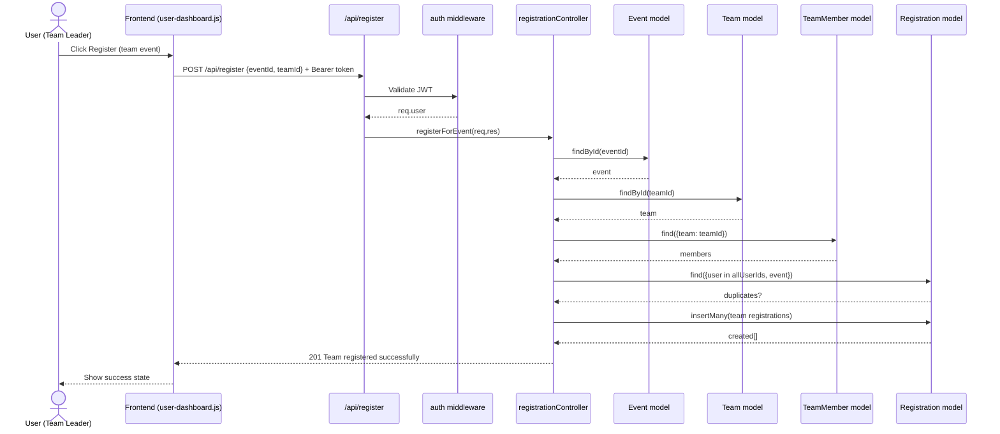

## 5.2 Context Viewpoint - Use Case Diagram

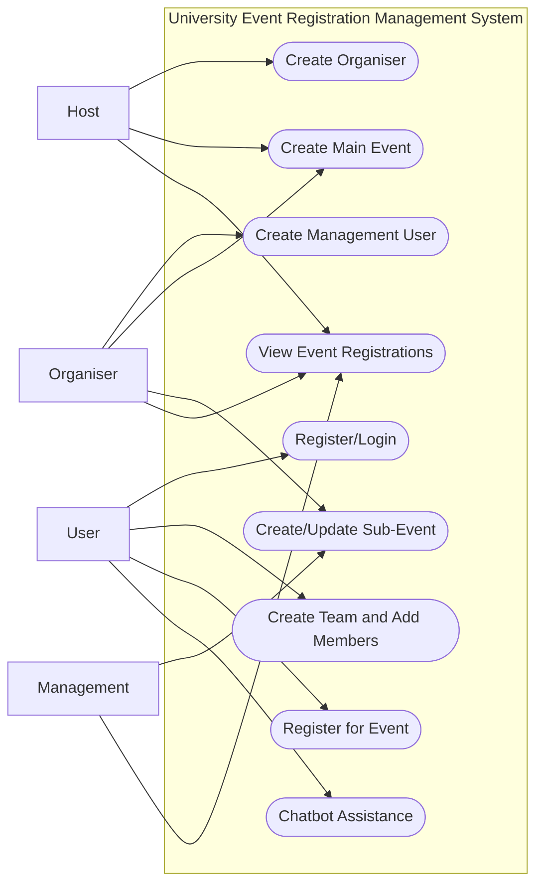

## 5.3 Composition Viewpoint - Package Diagram

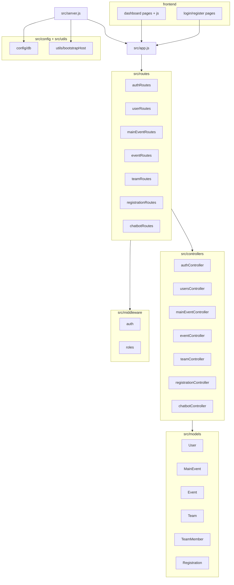

## 5.4 Logical Viewpoint - Class Diagram (Domain Model)

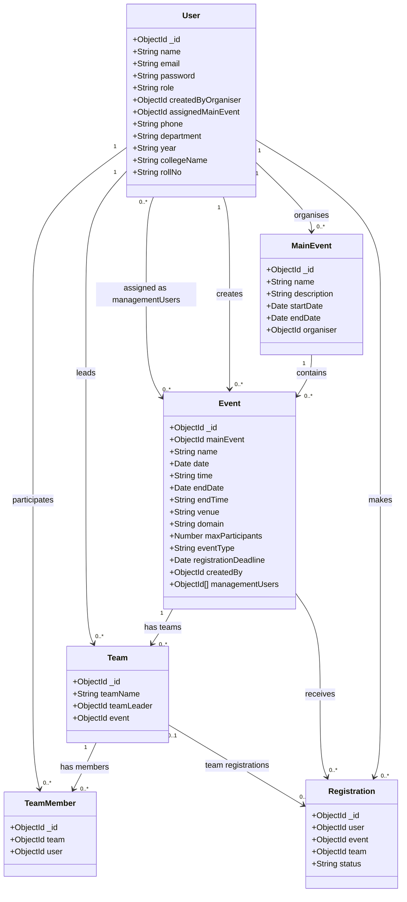

## 5.5 Dependency Viewpoint - Component Dependency Diagram

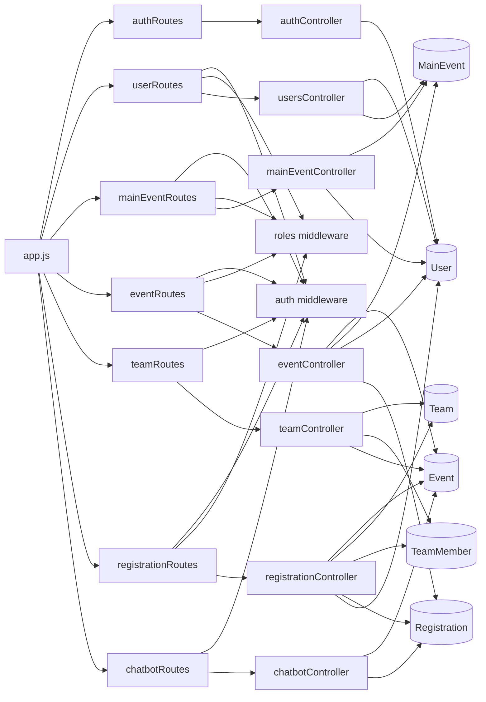

## 5.6 Information Viewpoint - Data Model Class Diagram

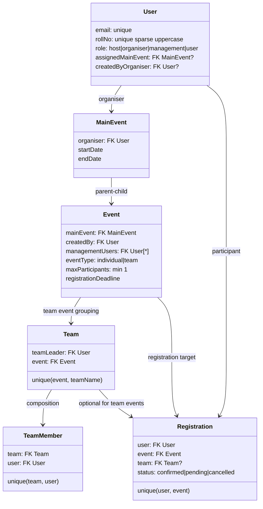

## 5.7 Patterns Use Viewpoint - Collaboration Diagram (Auth + RBAC)

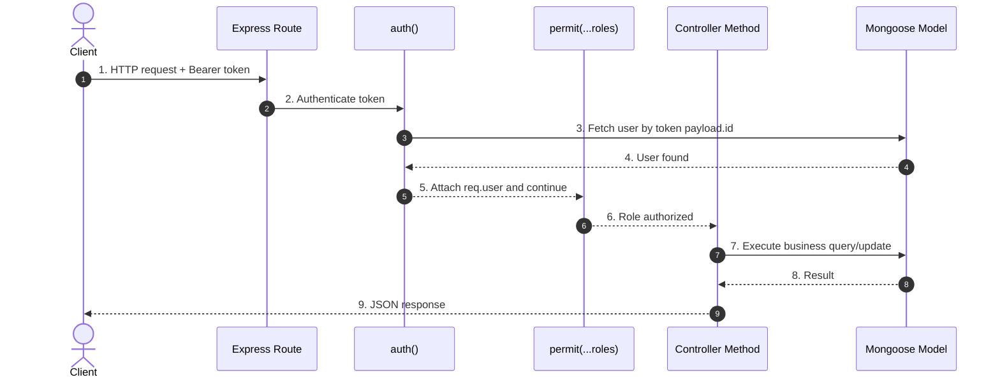

## 5.8 Interface Viewpoint - API Component Interfaces

```mermaid
flowchart LR
    FE[Frontend Pages + JS]

    subgraph API[Express API Interfaces]
      I1[/api/auth]
      I2[/api/users]
      I3[/api/main-events]
      I4[/api/events]
      I5[/api/team]
      I6[/api/register]
      I7[/api/chatbot]
    end

    subgraph Service[Controller Components]
      S1[Auth Service]
      S2[User Admin Service]
      S3[Main Event Service]
      S4[Sub-Event Service]
      S5[Team Service]
      S6[Registration Service]
      S7[Chatbot Service]
    end

    FE --> I1 --> S1
    FE --> I2 --> S2
    FE --> I3 --> S3
    FE --> I4 --> S4
    FE --> I5 --> S5
    FE --> I6 --> S6
    FE --> I7 --> S7
```

## 5.9 Structure Viewpoint - Deployment Diagram

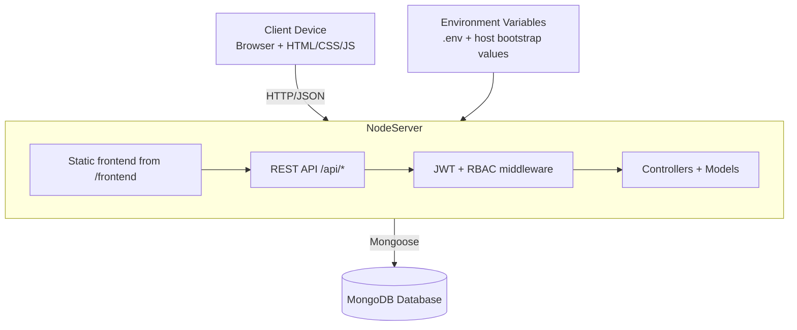

## 5.11 State Dynamics Viewpoint - Registration State Machine

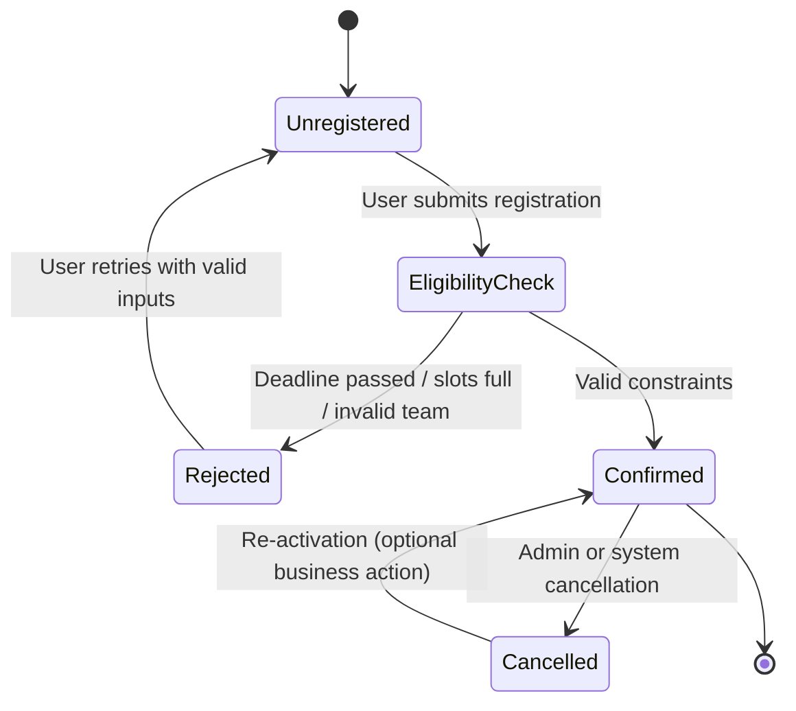

## 5.12 Algorithm Viewpoint - Activity Diagram (registerForEvent)

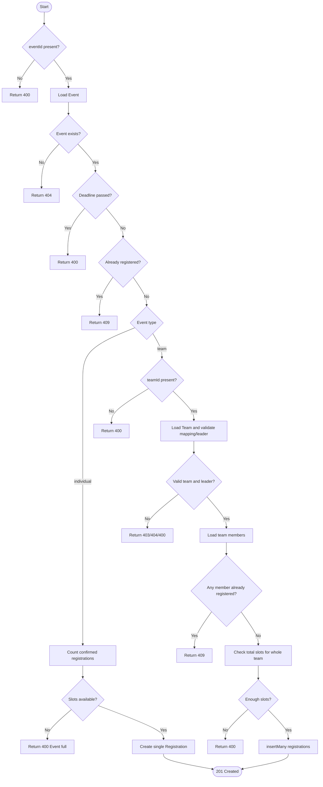

## 5.13 Resource Viewpoint - Deployment Resource Diagram

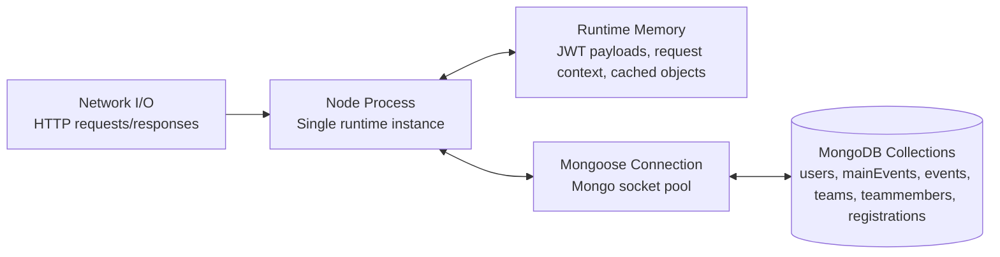

## Notes

- These diagrams are aligned with the current code structure and route/controller/model behavior.
- If you want, the next step is generating PlantUML versions for the same viewpoints.

## PlantUML Code (All Mentioned Viewpoints)

### 5.1 Interaction Viewpoint - Sequence Diagram (User Team Registration)

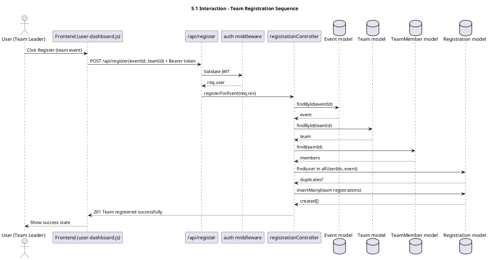

### 5.2 Context Viewpoint - Use Case Diagram

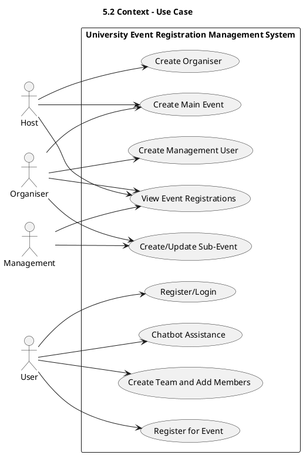

### 5.3 Composition Viewpoint - Package Diagram

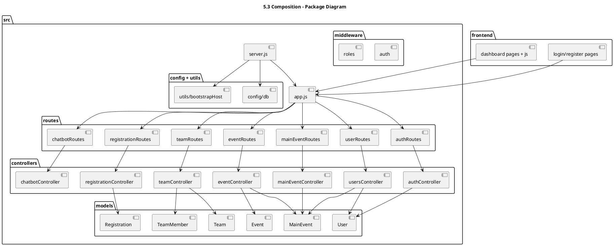

### 5.4 Logical Viewpoint - Class Diagram (Domain Model)

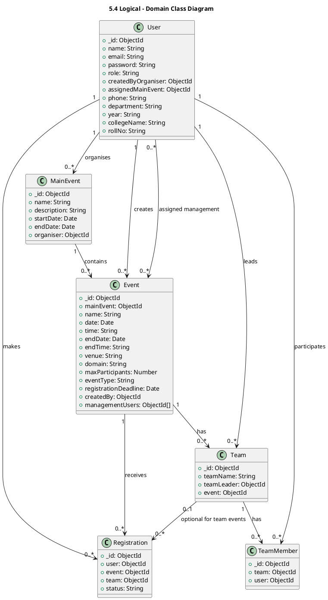

### 5.5 Dependency Viewpoint - Component Dependency Diagram

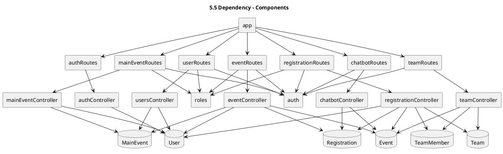

### 5.6 Information Viewpoint - Data Model Diagram

```plantuml
@startuml
title 5.6 Information - Data Model

entity User {
  * email : String <<unique>>
  * rollNo : String <<unique,sparse,uppercase>>
  * role : host|organiser|management|user
  --
  assignedMainEvent : MainEvent?
  createdByOrganiser : User?
}

entity MainEvent {
  * organiser : User
  * startDate : Date
  * endDate : Date
}

entity Event {
  * mainEvent : MainEvent
  * createdBy : User
  * managementUsers : User[*]
  * eventType : individual|team
  * maxParticipants : Number (min 1)
  * registrationDeadline : Date
}

entity Team {
  * teamLeader : User
  * event : Event
  --
  unique(event, teamName)
}

entity TeamMember {
  * team : Team
  * user : User
  --
  unique(team, user)
}

entity Registration {
  * user : User
  * event : Event
  team : Team?
  * status : confirmed|pending|cancelled
  --
  unique(user, event)
}

User ||--o{ MainEvent : organises
MainEvent ||--o{ Event : contains
Event ||--o{ Team : has
Team ||--o{ TeamMember : has
User ||--o{ Registration : owns
Event ||--o{ Registration : target
Team o|--o{ Registration : optional
@enduml
```

### 5.7 Patterns Use Viewpoint - Collaboration Diagram (Auth + RBAC)

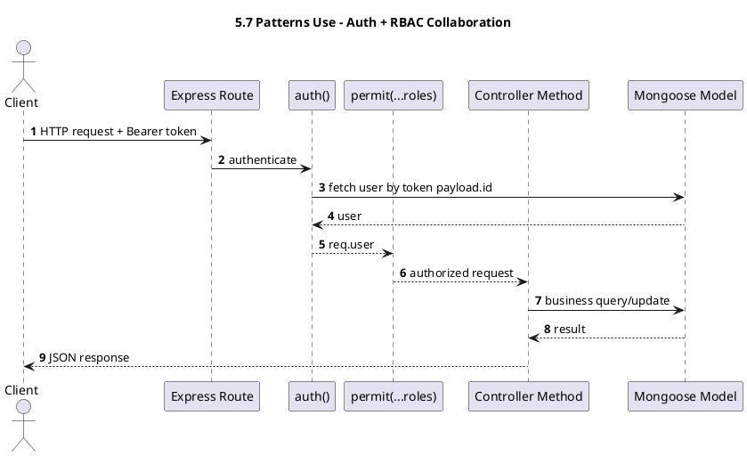

### 5.8 Interface Viewpoint - API Component Interfaces

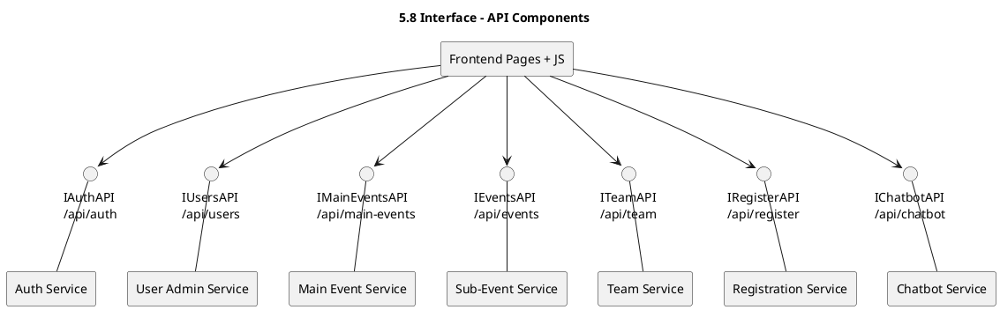

### 5.9 Structure Viewpoint - Deployment Diagram

```plantuml
@startuml
title 5.9 Structure - Deployment
node "Client Device\nBrowser + HTML/CSS/JS" as Client
node "Node.js Runtime\nExpress App" as Node
database "MongoDB" as Mongo
artifact ".env / env vars" as Env

node Node {
  component "Static frontend (/frontend)" as Static
  component "REST API (/api/*)" as API
  component "JWT + RBAC middleware" as Security
  component "Controllers + Models" as Logic

  API --> Security
  Security --> Logic
  Static --> API
}

Client --> Node : HTTP/JSON
Node --> Mongo : Mongoose
Env --> Node : configuration
@enduml
```

### 5.11 State Dynamics Viewpoint - Registration State Machine

```plantuml
@startuml
title 5.11 State Dynamics - Registration Lifecycle
[*] --> Unregistered

Unregistered --> EligibilityCheck : submit registration
EligibilityCheck --> Rejected : deadline passed / full / invalid team
EligibilityCheck --> Confirmed : constraints valid

Confirmed --> Cancelled : cancellation
Cancelled --> Confirmed : re-activation
Rejected --> Unregistered : retry with valid input
Confirmed --> [*]
@enduml
```

### 5.12 Algorithm Viewpoint - Activity Diagram (registerForEvent)

```plantuml
@startuml
title 5.12 Algorithm - registerForEvent Activity
start

if (eventId present?) then (yes)
  :Load Event;
  if (Event exists?) then (yes)
    if (Deadline passed?) then (no)
      if (Already registered?) then (no)
        if (Event type == individual?) then (yes)
          :Count confirmed registrations;
          if (Slots available?) then (yes)
            :Create single Registration;
            :Return 201 Created;
          else (no)
            :Return 400 Event full;
          endif
        else (team)
          if (teamId present?) then (yes)
            :Load Team and validate mapping/leader;
            if (Valid team + leader?) then (yes)
              :Load team members;
              if (Any member already registered?) then (no)
                :Check total slots for whole team;
                if (Enough slots?) then (yes)
                  :insertMany registrations;
                  :Return 201 Created;
                else (no)
                  :Return 400 Not enough slots;
                endif
              else (yes)
                :Return 409 Already registered member;
              endif
            else (no)
              :Return 403/404/400;
            endif
          else (no)
            :Return 400 teamId required;
          endif
        endif
      else (yes)
        :Return 409 Already registered;
      endif
    else (yes)
      :Return 400 Deadline passed;
    endif
  else (no)
    :Return 404 Event not found;
  endif
else (no)
  :Return 400 eventId required;
endif

stop
@enduml
```

### 5.13 Resource Viewpoint - Deployment Resource Diagram

```plantuml
@startuml
title 5.13 Resource - Runtime Resource View
node "Node Process\nSingle runtime instance" as CPU
node "Runtime Memory\nJWT payloads, request context, cached objects" as MEM
node "Network I/O\nHTTP requests/responses" as IO
node "Mongoose Connection\nMongo socket pool" as DBPOOL
database "Mongo Collections\nusers, mainEvents, events, teams, teammembers, registrations" as STORE

IO --> CPU
CPU <--> MEM
CPU <--> DBPOOL
DBPOOL <--> STORE
@enduml
```